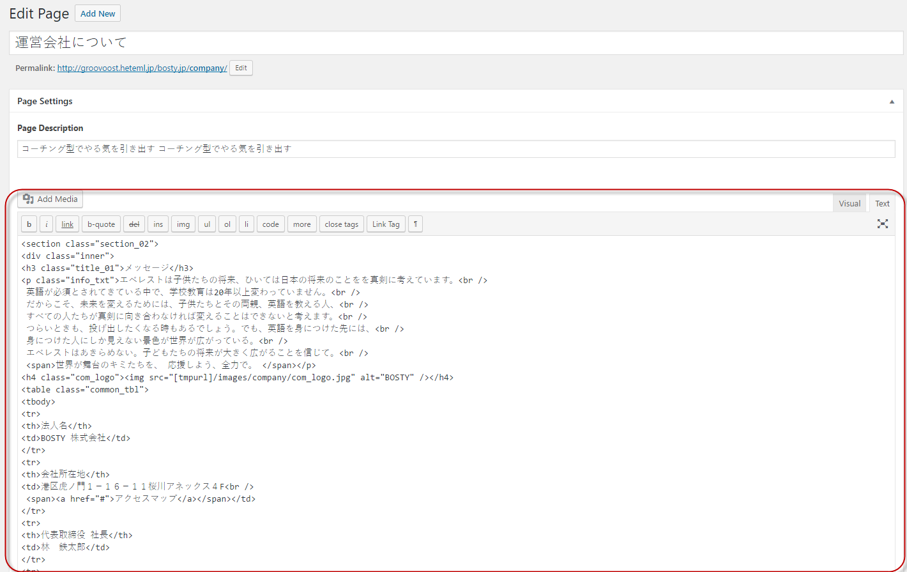
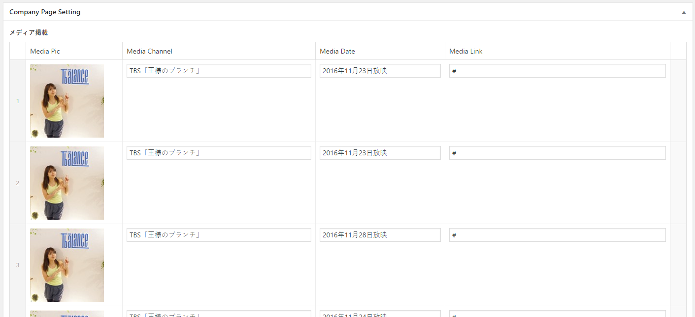
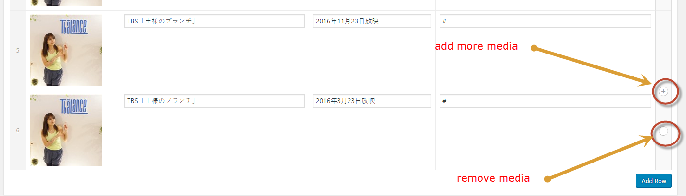

# Company Update

## You can go to 

!> Wordpress Admin => Pages => 運営会社について

## Click to edit => This area is content of Company Page

## Update content by editor in Wordpress Admin:

## This area list media for Company Page

## You can go to 

!> Wordpress Admin => Pages => 運営会社について

## Click to edit => We can insert data for each media

* Media Picture
* Media Channel
* Media Date
* Media Link

## Add/Delete Media

