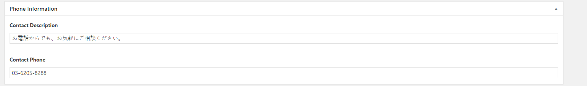
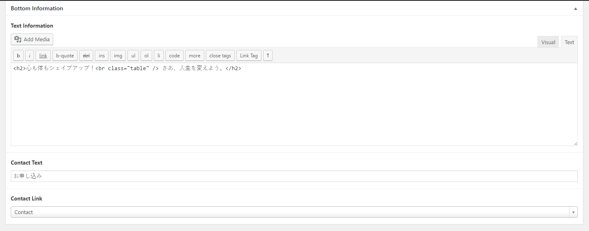

# Update Contact Information

This area is under of almost pages, so we can update in general page


## You can go to 

```text
Wordpress Admin => Theme Settings
```

## Check screen shot below:





!> Update this area will effect to all pages