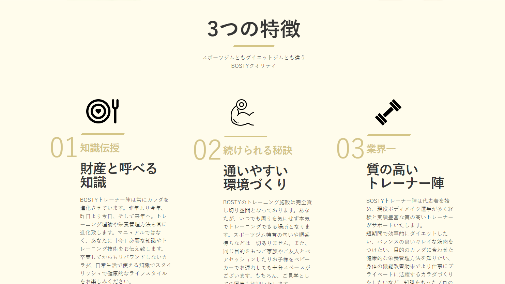
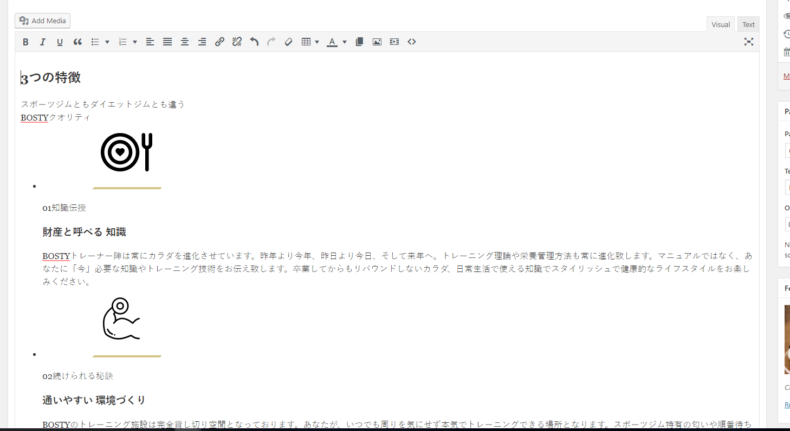
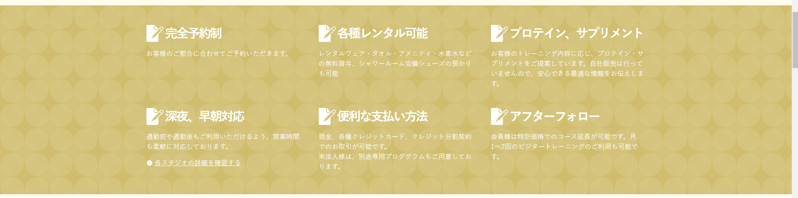
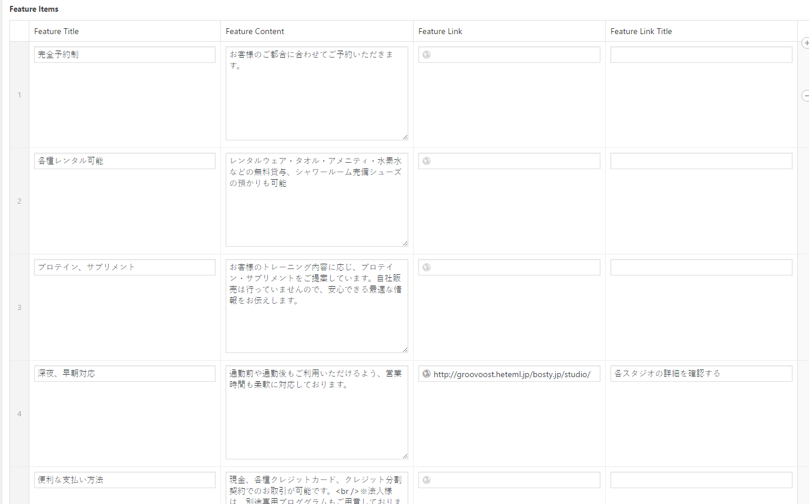
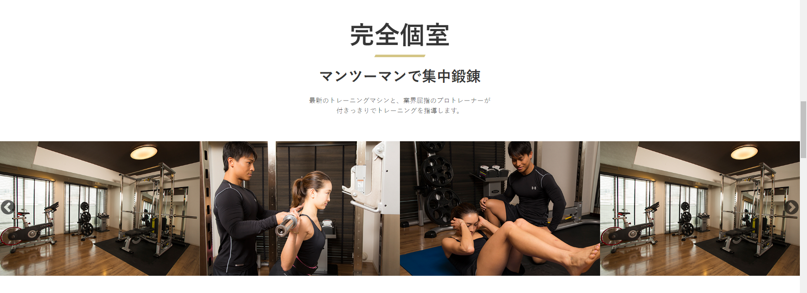
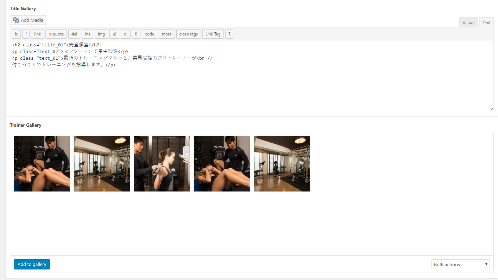

# Feature Page Update

## You can go to 

!> Wordpress Admin => Pages => BOSTYの特徴

## Click to edit => This area is content of feature Page

## Update content in editor area

## Update feature items 

## Add/Delete Feature item

## Update Features Trainer

## Add/Delete Feature Trainer Picture

