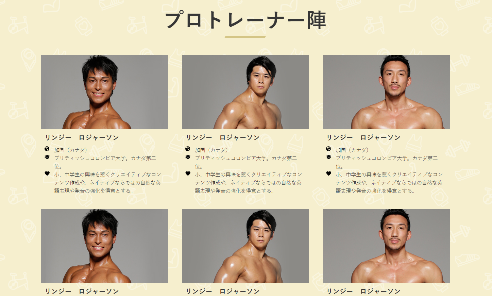
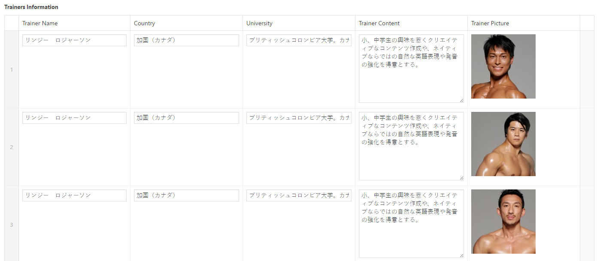

# Feature Page Update

## You can go to 

!> Wordpress Admin => Pages => BOSTYの特徴

## Click to edit => This area is content of feature Page

## Update content in editor area

## Update feature items 

## Add/Delete Feature item

## Update Trainer Gallery

## Add/Delete Trainer Gallery

## Trainer Profile

## Add/Delete Trainer Profile

* Trainer Name
* Country
* University
* Trainer Content
* Trainer Profile Picture

