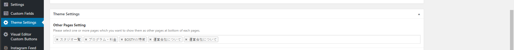

Update order of pages (you can select pages from your pages to show)


## You can go to 

```text
Wordpress Admin => Theme Settings
```

## Check screen shot below:



!> You can drag and drop order of each page to order pages in frontend