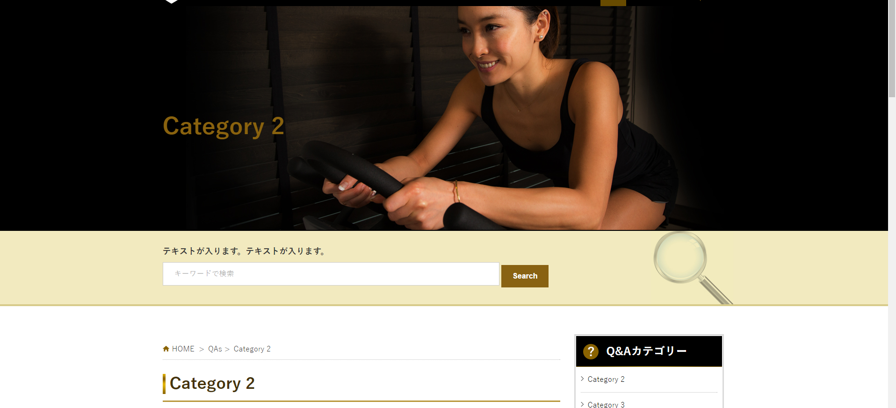
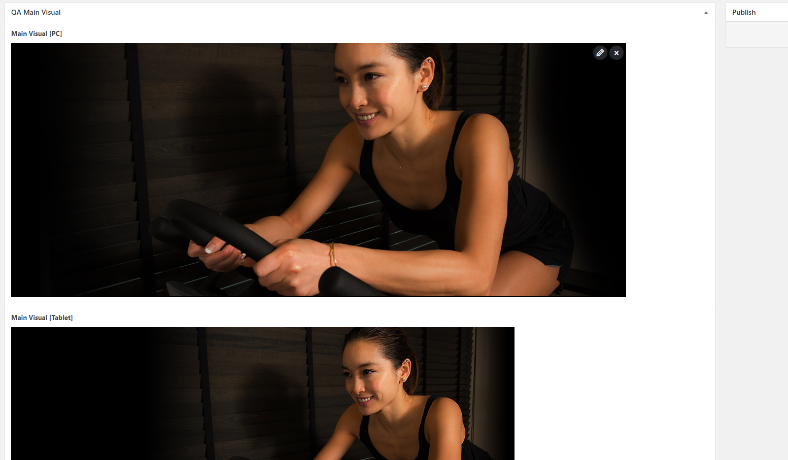

# QA Cover Background



## You can go to 

```text
Wordpress Admin => Theme Settings
```

## For best solution to be responsive:

Please update 3 sizes for PC, Tablet, SP (because they are using background size cover, according to HTML source).



!> Update this area will effect to all pages which don't have their cover background.