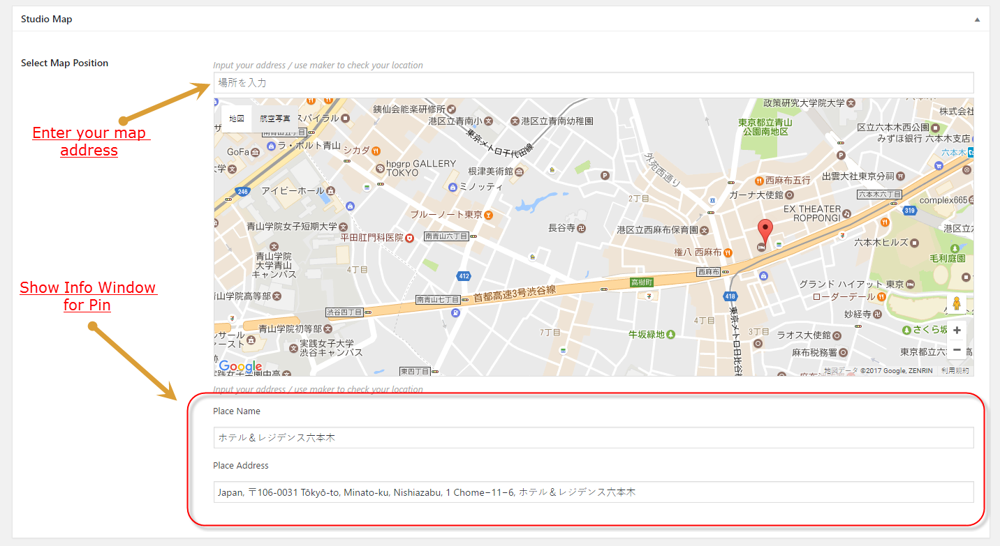
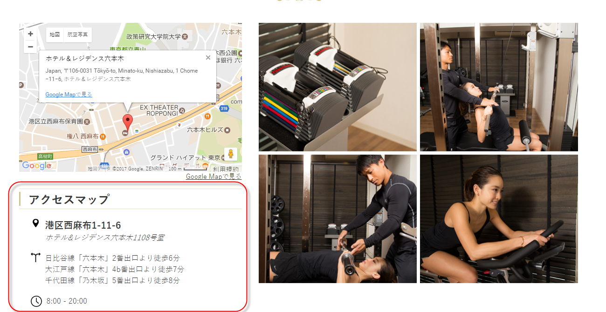

# Studio Update

## Edit Page

!> Wordpress Admin => Pages => 運営会社について

## Edit Cover Picture

## Update Studio

## You should go to Studio section to add more Studio

!> Wordpress Admin => スタジ

## Screenshot

## Click to edit => We can input some information

* Media Picture
* Media Channel
* Media Date
* Media Link

## Info Window for Pin will be shown here

## Studio Information

## You can edit information for map by edit below fields

## Upload Studio Pictures

## Upload pictures to gallery

!> You can Drag and drop pictures to arrange order for pictures